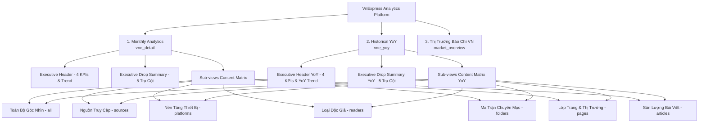
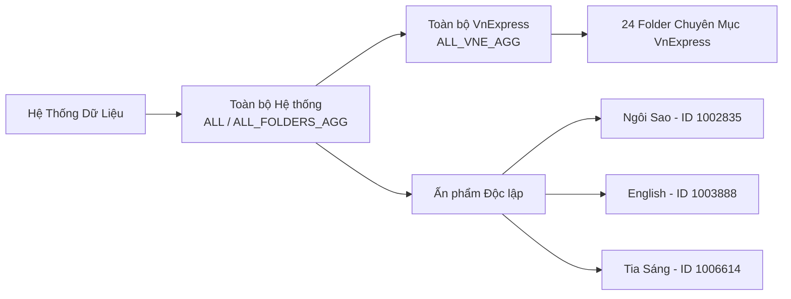

# TÀI LIỆU QUY TẮC TÍNH TOÁN & TEMPLATE DASHBOARD ANALYTICS VNEXPRESS

> **Mục đích tài liệu:** Lưu trữ chi tiết toàn bộ các quy tắc toán học, mô hình phân rã, công thức tính toán chỉ số và template thiết kế chuẩn hóa của hệ thống Dashboard **News Content Performance Analytics** (VnExpress & Báo chí số Việt Nam).
> **Nguyên tắc đồng bộ:** Chế độ **Historical (YoY)** áp dụng chính xác 100% template và bố cục giao diện của **Monthly Analytics**, sử dụng số liệu **Tổng lũy kế năm 2026** đối chiếu với **Cùng kỳ năm 2025**.

---

## MỤC LỤC
1. [Kiến Trúc & Cấu Trúc Toàn Bộ Dashboard](#1-kiến-trúc--cấu-trúc-toàn-bộ-dashboard)
2. [Nguyên Tắc Benchmark & Mốc Đối Chiếu](#2-nguyên-tắc-benchmark--mốc-đối-chiếu)
3. [Quy Tắc Tính Toán Toán Học & Chỉ Số (Math & Metric Rules)](#3-quy-tắc-tính-toán-toán-học--chỉ-số-math--metric-rules)
4. [Mô Hình Phân Rã Biến Động Kitagawa (Rate vs. Mix Effect)](#4-mô-hình-phân-rã-biến-động-kitagawa-rate-vs-mix-effect)
5. [Quy Tắc Tổng Hợp Dữ Liệu Theo Phạm Vi (Scope & Site Aggregation)](#5-quy-tắc-tổng-hợp-dữ-liệu-theo-phạm-vi-scope--site-aggregation)
6. [Template Chuẩn Hóa Giao Diện Dashboard (Dashboard Layout Templates)](#6-template-chuẩn-hóa-giao-diện-dashboard-dashboard-layout-templates)
7. [Đồng Bộ Giữa Monthly Analytics & Historical YoY](#7-đồng-bộ-giữa-monthly-analytics--historical-yoy)
8. [Từ Điển Dữ Liệu (Data Dictionary)](#8-từ-điển-dữ-liệu-data-dictionary)

---

## 1. KIẾN TRÚC & CẤU TRÚC TOÀN BỘ DASHBOARD

Hệ thống được tổ chức thành **3 Chế độ Dashboard chính** (Main Dashboards) và **7 Góc nhìn phân tích chuyên sâu** (Views/Tabs):



---

## 2. NGUYÊN TẮC BENCHMARK & MỐC ĐỐI CHIẾU

### 2.1. Chế độ Tháng (Monthly Analytics)
* **Kỳ phân tích ($T_{target}$):** Tháng được người dùng chọn (mặc định là Tháng mới nhất: `8/2026`).
* **Mốc chuẩn đối chiếu (Benchmark):** **Mốc Trung Vị Chu Kỳ Năm 2026** ($Median_{2026}$).
  * *Lý do:* Trung vị loại bỏ các ngoại lai (outliers) do các sự kiện nóng đột biến, phản ánh đúng năng lực cốt lõi trung bình ổn định của tòa soạn trong năm 2026.
* **Mốc MoM (Month-over-Month):** So sánh trực tiếp với tháng liền trước ($T_{target-1}$, ví dụ Tháng 8/2026 vs Tháng 7/2026).

### 2.2. Chế độ Cùng Kỳ (Historical YoY Analytics)
* **Kỳ phân tích ($T_{target}$):** **Tổng lũy kế các tháng năm 2026** ($\sum_{m=1}^{k} 2026$, ví dụ từ T1 đến T8 năm 2026).
* **Mốc chuẩn đối chiếu (Benchmark):** **Tổng cùng kỳ các tháng năm 2025** ($\sum_{m=1}^{k} 2025$, khớp chính xác các tháng tương ứng từ T1 đến T8 năm 2025).
* **Nguyên tắc đối sánh:**
  $$\text{Số tháng so sánh 2026} = \text{Số tháng đối chiếu 2025}$$

---

## 3. QUY TẮC TÍNH TOÁN TOÁN HỌC & CHỈ SỐ (MATH & METRIC RULES)

### 3.1. Hàm Trung Vị (Median)
Cho dãy số $X = [x_1, x_2, ..., x_n]$ đã được sắp xếp tăng dần $x_1 \le x_2 \le ... \le x_n$:
$$\text{Median}(X) = \begin{cases} 
x_{(n+1)/2} & \text{nếu } n \text{ lẻ} \\
\frac{x_{n/2} + x_{(n/2)+1}}{2} & \text{nếu } n \text{ chẵn}
\end{cases}$$

### 3.2. Độ Lệch Tuyệt Đối ($\Delta$) và Tỷ Lệ Biến Động (% Change)
* **Độ lệch tuyệt đối ($\Delta$):**
  $$\Delta = \text{Giá trị kỳ phân tích} - \text{Giá trị mốc chuẩn}$$
* **Tỷ lệ phần trăm biến động (%):**
  $$\% \text{Change} = \frac{\Delta}{\text{Giá trị mốc chuẩn}} \times 100\%$$
* **Quy ước màu sắc:**
  * $\Delta \ge 0$: Màu xanh lục (`text-emerald-600` / `bg-emerald-500`) - Tăng trưởng / Đạt chuẩn.
  * $\Delta < 0$: Màu đỏ hoa hồng (`text-rose-600` / `bg-rose-500`) - Suy giảm / Thâm hụt.

### 3.3. Tỷ Trọng Danh Mục (Share) & Dịch Chuyển Thị Phần ($\Delta Share$)
* **Tỷ trọng kỳ phân tích ($Share_{current}$):**
  $$Share_{current} = \frac{Y_{i, current}}{\sum_{j} Y_{j, current}} \times 100\%$$
* **Tỷ trọng mốc chuẩn ($Share_{benchmark}$):**
  $$Share_{benchmark} = \frac{Y_{i, benchmark}}{\sum_{j} Y_{j, benchmark}} \times 100\%$$
* **Độ dịch chuyển tỷ trọng ($\Delta Share$ - tính theo điểm phần trăm):**
  $$\Delta Share = Share_{current} - Share_{benchmark} \quad (\text{điểm \%})$$

### 3.4. Chỉ Số Hiệu Suất Phiên Đọc (PV / Session)
$$\text{PV / Session} = \frac{\text{Tổng Pageviews}}{\text{Tổng Sessions}}$$
* *Ý nghĩa:* Đo lường độ sâu phiên đọc của độc giả (độc giả đọc bao nhiêu trang trong một lần truy cập).

### 3.5. Tỷ Lệ Bài Viết Được Build Top (Build Top Rate)
$$\text{Build Top Rate} = \frac{A_{\text{BuildTop}}}{A_{\text{Total}}} \times 100\%$$
* $A_{\text{BuildTop}}$: Số lượng bài được chọn lọc đưa lên các vị trí đắc địa (Trang bìa, Top vị trí nổi bật).
* $A_{\text{Total}}$: Tổng sản lượng bài viết xuất bản ($A_{\text{Total}} = A_{\text{Biên tập thường}} + A_{\text{Thương mại PR}}$).

### 3.6. Cơ Cấu Phân Khúc Độc Giả (3 Nhóm)
* **Tổng độc giả:**
  $$P_{\text{Reader Total}} = P_{\text{New}} + P_{\text{Return}} + P_{\text{Lover}}$$
* **Tỷ lệ Độc giả Trung thành (% Lover):**
  $$\% Lover = \frac{P_{\text{Lover}}}{P_{\text{Reader Total}}} \times 100\%$$
* **Tổng nhóm giữ chân độc giả (Retention & Loyalty):**
  $$P_{\text{Retention}} = P_{\text{Return}} + P_{\text{Lover}}$$

---

## 4. MÔ HÌNH PHÂN RÃ BIẾN ĐỘNG KITAGAWA (RATE VS. MIX EFFECT)

Mô hình Kitagawa phân tách tổng độ lệch $\Delta Y_i$ của một thành phần $i$ thành 2 nguyên nhân độc lập:
$$\Delta Y_i = \text{Rate Effect} + \text{Mix Effect}$$

Giả sử:
* $Y_{t}$ là tổng toàn trang ở kỳ hiện tại, $Y_{0}$ là tổng toàn trang ở mốc chuẩn.
* $w_{i, t} = \frac{Y_{i, t}}{Y_{t}}$ là tỷ trọng thành phần $i$ ở kỳ hiện tại.
* $w_{i, 0} = \frac{Y_{i, 0}}{Y_{0}}$ là tỷ trọng thành phần $i$ ở mốc chuẩn.

### Công thức:
1. **Hiệu ứng Quy mô Toàn trang (Rate Effect / Volume Impact):**
   $$\text{Rate Effect}_i = \left( \frac{w_{i, t} + w_{i, 0}}{2} \right) \times (Y_t - Y_0)$$
   *Ý nghĩa:* Mức biến động lượt xem xảy ra thuần túy do dung lượng toàn bộ trang tăng lên hoặc giảm đi.
2. **Hiệu ứng Dịch chuyển Cơ cấu Nội bộ (Mix Shift Effect / Share Impact):**
   $$\text{Mix Effect}_i = (w_{i, t} - w_{i, 0}) \times \left( \frac{Y_t + Y_0}{2} \right)$$
   *Ý nghĩa:* Mức biến động lượt xem xảy ra do thành phần $i$ bị thu hẹp hoặc mở rộng thị phần bên trong tòa soạn.

---

## 5. QUY TẮC TỔNG HỢP DỮ LIỆU THEO PHẠM VI (SCOPE & SITE AGGREGATION)

Hệ thống cho phép lọc theo đa tầng phạm vi dữ liệu:



### Chi tiết logic tổng hợp:
1. **`ALL` / `ALL_FOLDERS_AGG` (Toàn bộ Hệ thống):**
   * Cộng gộp tất cả bản ghi có trong dataset (bao gồm VnExpress và toàn bộ các ấn phẩm trực thuộc).
2. **`ALL_VNE_AGG` (Toàn bộ VnExpress):**
   * Cộng gộp tất cả chuyên mục loại trừ 3 ấn phẩm đặc thù: Ngôi Sao (`1002835`), English (`1003888`), Tia Sáng (`1006614`).
3. **Ấn phẩm Đơn lẻ (Site Level):**
   * Lọc theo trường `site_name` (`VnExpress`, `Ngoi sao`, `English`, `Tia sáng`).
4. **Chuyên mục Đơn lẻ (Folder Level):**
   * Khớp chính xác theo `folder_id` (ví dụ: `1001005` - Thời sự, `1001002` - Thế giới, `1000000` - Trang Home).

---

## 6. TEMPLATE CHUẨN HÓA GIAO DIỆN DASHBOARD (DASHBOARD LAYOUT TEMPLATES)

Mỗi Dashboard (cả Monthly và YoY) đều tuân theo cấu trúc **3 Khối Thống Nhất**:

```
+-----------------------------------------------------------------------------------+
| KHỐI 1: EXECUTIVE HEADER & 4 KPIS SCORECARD                                      |
| [Tiêu đề & Tag] [Nút Chức năng: Excel, Google Sheets, Báo cáo]                     |
| [Bộ lọc: Kỳ phân tích | Site | Chuyên mục Folder]                                 |
| +-------------------+ +-------------------+ +-------------------+ +----------------+ |
| | Tổng Pageview     | | Tổng Session      | | Sản lượng Bài     | | Bài Build Top  | |
| | (PV, Delta, %)    | | (Sessions, PV/S)  | | (Articles, Delta) | | (Bài, Tỷ lệ %) | |
| +-------------------+ +-------------------+ +-------------------+ +----------------+ |
| [Bảng Tổng hợp Đa tháng / Multi-month Mini Matrix Table]                           |
| [Navigation Pills: Toàn bộ | Nguồn | Thiết bị | Độc giả | Chuyên mục | Lớp trang | Bài] |
+-----------------------------------------------------------------------------------+
| KHỐI 2: EXECUTIVE DROP SUMMARY (KẾT LUẬN NGUYÊN NHÂN SỤT GIẢM THEO 5 TRỤ CỘT)     |
| [Box 1: Nguồn truy cập]  [Box 2: Nền tảng PC/Mobile]   [Box 3: Folder thâm hụt]    |
| [Box 4: Lớp trang Detail] [Box 5: Hiệu suất Bài viết]                             |
+-----------------------------------------------------------------------------------+
| KHỐI 3: CHI TIẾT CÁC GÓC NHÌN (SUB-VIEWS CONTAINER)                               |
| [View 1: Nguồn Truy Cập (Traffic Sources - 8 Nguồn)]                              |
| [View 2: Nền Tảng Thiết Bị (Platforms & Devices)]                                  |
| [View 3: Loại Độc Giả (Reader Segments: New • Return • Lover)]                     |
| [View 4: Phân Rã Chuyên Mục (Folder Breakdown Matrix)]                            |
| [View 5: Lớp Trang & Thị Trường (Page Layers & Markets)]                          |
| [View 6: Sản Lượng & Chất Lượng Bài Viết (Articles & Build Top)]                   |
+-----------------------------------------------------------------------------------+
```

### 6.1. Template Bảng Dữ Liệu Chuẩn 5 Cột (Standard 5-Column Data Table)
Tất cả các sub-views (Traffic, Platforms, Readers, Pages, Articles) đều sử dụng cấu trúc bảng chuẩn hóa:

| Cột 1: Chiều Phân Tích | Cột 2: Tỷ Trọng (%) | Cột 3: Kỳ Hiện Tại | Cột 4: Mốc Chuẩn Đối Chiếu | Cột 5: Độ Lệch & Thanh Đo Visual |
|:---|:---:|:---:|:---:|:---:|
| **Tên chỉ số / Phân loại** | **Tỷ trọng hiện tại**<br>*(Chuẩn so sánh)* | **Tháng này / Tổng 2026** | **Trung vị 2026 / Cùng kỳ 2025** | **$\Delta$ Tuyệt đối (% Biến động)**<br>*(Thanh đo visual bar)* |

---

## 7. ĐỒNG BỘ GIỮA MONTHLY ANALYTICS & HISTORICAL YOY

Bảng ánh xạ tương đương giữa 2 chế độ:

| Hạng Mục | Monthly Analytics (`vne_detail`) | Historical YoY (`vne_yoy`) |
|:---|:---|:---|
| **Kỳ Phân Tích ($T_{current}$)** | Tháng cụ thể năm 2026 (ví dụ: `8/2026`) | **Tổng lũy kế năm 2026** ($\sum_{m=1}^k 2026$) |
| **Mốc Đối Chiếu ($T_{benchmark}$)** | **Mốc Trung vị năm 2026** ($Median_{2026}$) | **Cùng kỳ năm 2025** ($\sum_{m=1}^k 2025$) |
| **Bản đồ So Sánh** | $T_{current}$ vs $Median_{2026}$ | Tổng 2026 vs Cùng kỳ 2025 |
| **KPI 1: Pageviews** | PV Tháng vs Trung vị PV 2026 | Tổng PV 2026 vs Tổng PV 2025 cùng kỳ |
| **KPI 2: Sessions** | Session Tháng vs Trung vị Session | Tổng Session 2026 vs Tổng Session 2025 |
| **KPI 3: Articles** | Sản lượng bài Tháng vs Trung vị Bài | Tổng bài 2026 vs Tổng bài 2025 |
| **KPI 4: Build Top** | Bài Build Top Tháng vs Trung vị Build Top | Tổng Build Top 2026 vs Tổng Build Top 2025 |
| **Biểu Đồ Xu Hướng** | 8 Tháng năm 2026 (T1 $\rightarrow$ T8) | Đầy đủ timeline 2025 $\rightarrow$ 2026 |
| **Layout & Cấu trúc View** | Cấu trúc 3 khối, chuẩn bảng 5 cột | **100% Giống Monthly Analytics** |

---

## 8. TỪ ĐIỂN DỮ LIỆU (DATA DICTIONARY)

| Tên Trường (Field) | Kiểu Dữ Liệu | Ý Nghĩa / Định Nghĩa Chi Tiết |
|:---|:---:|:---|
| `month` | String | Tháng/Năm phân tích (Định dạng: `M/YYYY`, ví dụ `8/2026`) |
| `folder_id` | String | Mã định danh Folder/Chuyên mục (`1000000`: Home, `1001005`: Thời sự,...) |
| `folder` | String | Tên hiển thị của chuyên mục/ban |
| `site_name` | String | Tên ấn phẩm (`VnExpress`, `Ngoi sao`, `English`, `Tia sáng`) |
| `pageviews` | Number | Tổng lượt xem trang trong kỳ (PV) |
| `pageviewsNoAds` | Number | Lượt xem trang không gắn quảng cáo |
| `pageviewsAds` | Number | Lượt xem trang có quảng cáo |
| `sessions` | Number | Tổng số phiên truy cập của độc giả (Cột Z) |
| `articles` | Number | Tổng sản lượng bài viết xuất bản ($A_{\text{Total}}$) |
| `articleThuong` | Number | Sản lượng bài viết biên tập thông thường |
| `articleThuongMai` | Number | Sản lượng bài viết thương mại / PR tài trợ |
| `aBuildTop` | Number | Số lượng bài được chọn lọc đưa lên Build Top trang bìa |
| `aNonBuildTop` | Number | Số lượng bài viết thông thường không build top |
| `pExDirect` | Number | Pageviews từ nguồn Trực tiếp (Direct - gõ URL, bookmark, app) |
| `pExDirectBrandname`| Number | PV Direct có chứa từ khóa nhận diện thương hiệu |
| `pExGoogle` | Number | Pageviews từ công cụ tìm kiếm Google Search & Discover |
| `pExGoogleSearch` | Number | PV phân rã riêng từ Google Organic Search |
| `pExGoogleDiscover`| Number | PV phân rã riêng từ Google Discover Feed |
| `pExSocial` | Number | Pageviews từ mạng xã hội (Facebook, Zalo, YouTube,...) |
| `pInHome` | Number | Pageviews điều hướng nội bộ từ Trang Chủ (Home) |
| `pInFolder` | Number | Pageviews điều hướng nội bộ từ Trang Danh mục (Listing) |
| `pInDetail` | Number | Pageviews điều hướng nội bộ từ Bài viết khác (Detail) |
| `pInTagTopic24h` | Number | Pageviews điều hướng từ Tag, Topic, Dòng sự kiện 24H |
| `pInOther` | Number | Pageviews từ các luồng nội bộ khác |
| `pMobile` | Number | Pageviews trên nền tảng Mobile Web (Điện thoại) |
| `pPC` | Number | Pageviews trên nền tảng Máy tính để bàn / Laptop (PC Desktop) |
| `pApp` | Number | Pageviews trên ứng dụng VnExpress App |
| `pTablet` | Number | Pageviews trên máy tính bảng (Tablet) |
| `pOtherPlatform` | Number | Pageviews trên các nền tảng thiết bị khác |
| `pNew` | Number | Lượt đọc của Phân khúc Độc Giả Mới (Tân khách) |
| `pReturn` | Number | Lượt đọc của Phân khúc Độc Giả Quay Lại (Định kỳ) |
| `pLover` | Number | Lượt đọc của Phân khúc Độc Giả Trung Thành (Thân thiết / Gắn bó) |
| `pListing` | Number | Lượt xem lớp trang Danh mục chuyên mục (Category Listing) |
| `pDetail` | Number | Lượt xem lớp trang Bài viết chi tiết (Article Detail) |
| `pDO` | Number | Lượt xem từ độc giả Trong nước (Domestic) |
| `pOV` | Number | Lượt xem từ độc giả Nước ngoài (Overseas / Kiều bào) |

---
*Tài liệu được cập nhật và kiểm duyệt tự động cho hệ thống Dashboard VnExpress.*